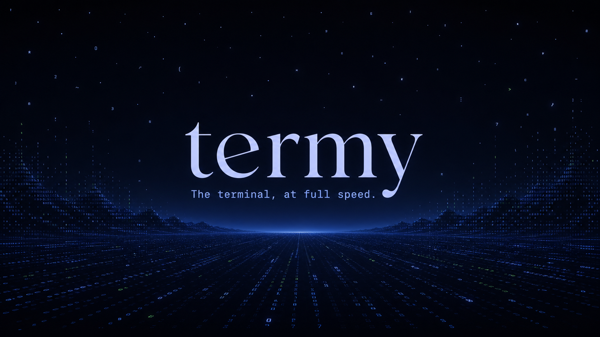

<p align="center">
  
</p>

<p align="center">
  <a href="https://github.com/lassejlv/termy/releases/latest"></a>
  <a href="https://github.com/lassejlv/termy/stargazers"></a>
  <a href="./LICENSE"></a>
</p>

<p align="center">
  <a href="https://termy.sh/download"><strong>Download</strong></a> ·
  <a href="https://termy.sh/docs"><strong>Documentation</strong></a> ·
  <a href="https://github.com/lassejlv/termy/releases"><strong>Releases</strong></a> ·
  <a href="./CONTRIBUTING.md"><strong>Contribute</strong></a>
</p>

Termy is a fast, native terminal for macOS, Linux, and Windows. It combines GPU-accelerated rendering with the terminal workflows you use every day—tabs, splits, search, tasks, layouts, themes, and optional tmux sessions—without turning the interface into a control panel.

- Damage-scoped GPU rendering with dirty-span cell caching
- Tabs, splits, search, tasks, and reusable layouts
- Configurable keybindings, colors, themes, and terminal behavior
- Optional tmux control-mode sessions
- Native platform integration with a reusable headless runtime and FFI

## Install

Download the latest build from **[termy.sh/download](https://termy.sh/download)** or browse every artifact on **[GitHub Releases](https://github.com/lassejlv/termy/releases)**.

macOS DMGs from v0.2.75 onward are signed and notarized. Open the DMG and drag
Termy to `/Applications`. See [macOS troubleshooting](https://termy.sh/docs/getting-started/troubleshooting)
if the app still does not open.

### Build from source

Termy is a Rust workspace. Build and launch the desktop app with:

```bash
cargo run --release -p termy
```

See the [installation guide](https://termy.sh/docs/getting-started/installation) for platform-specific steps.

## What you can shape

Termy keeps its behavior in plain configuration rather than burying it in hidden application state.

| Surface | What you control |
| --- | --- |
| Appearance | Themes, colors, fonts, chrome contrast, and tab presentation |
| Input | Keybindings, terminal behavior, mouse reporting, and shortcuts |
| Workspace | Tabs, split panes, tasks, reusable layouts, and working directories |
| Sessions | Local shells and optional tmux-backed sessions |

Start with [Customize Termy](https://termy.sh/docs/customize) or use the complete [configuration reference](https://termy.sh/docs/reference/configuration-reference).

## Architecture

Termy is more than a window around a PTY. Its terminal emulation uses Termy's own streaming parser, screen storage, and native PTY runtime. The repository also contains a GPUI desktop application, CLI, native FFI, website, and release tooling.

```text
desktop / embedding hosts
        │
        ├── terminal UI and platform integration
        │
        ├── reusable command, search, theme, and release crates
        │
        └── terminal runtime, PTY, parser, and rendering snapshots
```

Read [Project Layout](./docs/architecture/project-layout.md) for ownership boundaries and [Release Packaging](./docs/architecture/release-packaging.md) for artifact flow.

## Sponsors

Termy is supported by companies and people who care about fast, native developer tools.

<p align="center">
  <a href="https://neon.tech">
    <picture>
      <source media="(prefers-color-scheme: dark)" srcset="./assets/legends/neon-logo-dark-color.svg" />
      <source media="(prefers-color-scheme: light)" srcset="./assets/legends/neon-logo-light-color.svg" />
      
    </picture>
  </a>
  &nbsp;&nbsp;&nbsp;&nbsp;
  <a href="https://github.com/mezotv">
    
  </a>
</p>

## Termy X

Termy X is a fork layer on [Termy](https://github.com/lassejlv/termy) (MIT, © Lasse Jørgensen). The terminal itself is unchanged. X reads, drafts, and publishing live in `crates/x_core` so upstream merges stay small. The desktop app gains a side panel; the CLI gains `termy x` and a standalone `x` binary.

No X API credits are needed. The official API is off unless you set `official_api.enabled = true`.

### Commands

```bash
x
x splash
x doctor
x timeline
x search "gpui" --recent --limit 10
x feed --topic "generator sizing" --hot
x feed --upcoming
x feed --dry-run --keys "j;r;type:hello from the terminal;p;y"
x lookup @termy
x thread 1001
x trends --place worldwide
x popular gpui
x draft "ship the panel" --n 3 --tone punchy
x compose --text "hello from the terminal"
x post --dry-run "hello world"   # prints every part and never posts
x post "hello world"             # prints every part, then you type yes
x publish <draft-id> --dry-run
x research "gpui terminals"
termy x doctor                   # same commands through the Termy CLI
```


`x feed` is the hot / upcoming list. With no topic it loads the home timeline on the free OpenCLI session (`twitter timeline`), or `twitter search` when you pass `--topic` or type `/subject`. `--hot` ranks by engagement then recency. `--upcoming` (the default) ranks by recency then engagement. The same list accepts a reply:

| Key | Action |
| --- | --- |
| `j` / `k` | Next / previous tweet |
| `h` / `u` | Re-rank the current list hot / upcoming. No extra request. |
| `/subject` | Topic search into the same list. One OpenCLI search. |
| `r` | Open the reply box for the selected tweet |
| a line of text, or `type:text` | Set the reply draft. Does not post. |
| `p` | Preview the exact reply |
| `y` | Post that preview as the logged-in account. Ignored until `p`. |
| `esc` | Close the reply box. Nothing is posted. |
| `q` | Quit |

`y` calls `opencli twitter reply` through the existing confirm path. `--dry-run` prints the plan and does not post. There is no auto-reply and no bulk reply. The status bar shows `quota: N remaining` only when that session response already includes a remaining count. Otherwise it says `quota: not reported`. It does not call the paid X API to ask.

`--json` prints machine-readable output. `--provider mock` forces fixtures (what the tests use). Tones for `x draft` are `punchy`, `informative`, `thread`, and `reply`.

`x` and `x splash` print an original Unicode bird (blue and cyan, pink heart). `NO_COLOR` turns the ANSI colors off.

`x post` and `x publish` never post until you type `yes`. They print the exact text of every part first, with the weighted count of each part (twitter-text v3, limit 280). `--dry-run` prints the same plan, including which provider would be used, and does not ask and does not post. A thread sent through the web intent opens one intent at a time: each part is copied to the clipboard, then the CLI waits for `next`.

### Free providers

Reads try, in order:

1. [OpenCLI](https://github.com/jackwener/opencli) `twitter` adapter (`profile`, `thread`, `search`, `timeline`, `trending`, `whoami`). Uses your logged-in Chrome session and the Browser Bridge extension. Reads pass `--window background`. Termy X does not automate login or store passwords.
2. [twitter-cli](https://github.com/public-clis/twitter-cli), the X path used by [Agent Reach](https://github.com/Panniantong/Agent-Reach) (`user`, `tweet`, `search`, `feed`, `status`). Auth is your own cookie (`TWITTER_AUTH_TOKEN` and `TWITTER_CT0`, or the browser cookie jar). "Popular" is search ranked by engagement. Trends fall back to that ranking when a trends endpoint is missing.
3. Built-in mock fixtures, so the app and tests run with nothing installed.

Research (not an X credit) uses OpenCLI Reddit and YouTube search, `yt-dlp`, a web reader, and RSS.

Publishing tries, in order, and still requires you to type `yes`:

1. `opencli twitter post` / `opencli twitter reply`, only when `opencli twitter --help` lists `post`
2. `twitter post` / `twitter post --reply-to`, only when `twitter --help` lists `post`
3. An X web intent: `https://x.com/intent/post?text=...` (and `in_reply_to` on the first part). One intent per part. Termy X copies the part and opens the intent; you click Post.

`x doctor` reports each free provider as `working`, `missing`, or `not logged in`, plus the AI endpoint. It says **No X API credits are needed.** It never posts and never logs in. Cookie and browser-session providers are labeled "uses your own logged-in session". On Windows, command shims resolve in PATHEXT order (`opencli.cmd` ahead of the extensionless shell script, then `.ps1`) and run with `CREATE_NO_WINDOW` so a console does not flash.

### Optional official API

Create an app at the X developer portal, set `official_api.enabled = true`, and export the client id:

```bash
export TERMY_X_CLIENT_ID=...
x auth
```

`x auth` prints an OAuth 2.0 PKCE authorize URL (scopes include `tweet.read` and `tweet.write`) and can exchange a code into the OS keychain (service `termy-x`) or a `0600` file. The localhost callback listener is not started for you; paste the redirect yourself only if you finish the exchange out of band. Cost figures in the status line are labeled estimates (post read $0.005, user read $0.010, post write $0.010) and are not a bill.

### AI drafts

Drafts stay drafts. Nothing is auto-posted.

The client is OpenAI-compatible. `TERMY_X_AI_BASE_URL`, `TERMY_X_AI_API_KEY`, and `TERMY_X_AI_MODEL` are the Termy names. `OPENAI_BASE_URL` and `OPENAI_API_KEY` are also accepted. With nothing set, Termy X tries a free local Ollama at `http://127.0.0.1:11434/v1` (model `llama3.2`). If nothing is reachable, `x draft` still returns offline templates labelled `template`.

```bash
# Ollama (the free default). Pull a small model once: ollama pull llama3.2
export TERMY_X_AI_BASE_URL=http://127.0.0.1:11434/v1
export TERMY_X_AI_MODEL=llama3.2

# LM Studio's local server
# export TERMY_X_AI_BASE_URL=http://127.0.0.1:1234/v1

# Groq free tier, or an OpenRouter model whose id ends in :free
# export TERMY_X_AI_BASE_URL=https://api.groq.com/openai/v1
# export OPENAI_BASE_URL=https://openrouter.ai/api/v1
# export OPENAI_API_KEY=...
x draft "ship the panel" --tone informative
```

Other free OpenAI-compatible servers: llama.cpp's `llama-server` and any local server that speaks `/v1/chat/completions`. Prompt text lives in `crates/x_core/prompts/default.toml`.

### Config

`x config` prints an example. The file is `~/.config/termy/x.toml`.

| Key | Default | Meaning |
| --- | --- | --- |
| `background_art` | `true` | Geometric swift behind the panel, and the CLI splash |
| `background_opacity` | `0.18` | Bird strength behind lists. The splash stays at full strength |
| `provider` | `auto` | `auto`, `opencli`, `twitter`, `mock`, or `official` |
| `default_limit` | `10` | Page size, clamped to 20 on the CLI |
| `official_api.enabled` | `false` | Turn on the paid API |
| `ai.base_url_env` | `TERMY_X_AI_BASE_URL` | Env var that holds the chat endpoint |
| `shell.min_interval_ms` | `1500` | Pause between shell-outs |

### Desktop panel

Open it with `Ctrl+Shift+X` (`Cmd+Shift+X` on macOS) or the command palette entries under X: Timeline, Search, Trends, Lookup, Compose, Research. Compose shows a live preview, the weighted counter, thread splits, and "Suggest variants". Publish opens a confirm dialog with the exact text of each part. "Next post" opens one web intent at a time. "Copy" copies that part. Nothing is posted automatically.

The background is an original low-poly swift (electric blue and cyan, magenta heart with a `+1`) in `assets/x/termy-x-bird.svg`, drawn for a 1600×1000 frame and scaled with object-fit cover. Behind lists it is drawn at `background_opacity` (default 0.18). The empty splash shows it at full strength. "Art on/off" writes `background_art` into `x.toml`. Turning art off skips rasterization. The CLI prints a small ANSI bird when that flag is on.

On a wide preview the panel is three columns (compose, results, trends). It drops to two columns, then one, as the window gets narrower.

Preview the panel on fixture data (no network):

```bash
cargo run -p termy --bin x_panel_preview -- --mock --width 1600 --height 1000
cargo run -p termy --bin x_panel_preview -- --splash
```

## Roadmap and contributing

- [Engineering quality roadmap](./docs/engineering/roadmap.md)
- [Contributor setup and validation](./CONTRIBUTING.md)

Contributions are welcome. Keep changes scoped, run the nearest validation command, and preserve the boundaries documented in the architecture guide.

<p align="center">
  <sub>MIT licensed · Built in Rust · <a href="https://termy.sh">termy.sh</a></sub>
</p>
